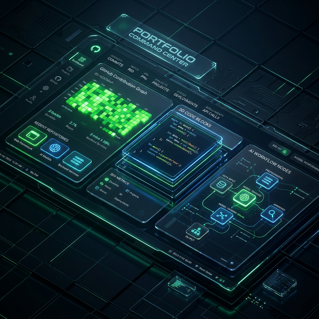

<div align="center">
  

  #  GreenHacker Portfolio & CMS

  **A Next-Generation, Agentic Full-Stack Portfolio Platform**

  [](https://nextjs.org/)
  [](https://reactdev.com/)
  [](https://www.typescriptlang.org/)
  [](https://www.prisma.io/)
  [](https://tailwindcss.com/)
  [](https://opensource.org/licenses/MIT)

  <p align="center">
    <a href="#key-features"> Features</a> •
    <a href="#tech-stack-breakdown"> Tech Stack</a> •
    <a href="#getting-started"> Quick Start</a> •
    <a href="#architecture--data-flow"> Architecture</a> •
    <a href="#contributing--contact"> Contact</a>
  </p>
</div>

---

##  Key Features

This platform is more than just a portfolio—it is a comprehensive Content Management System (CMS) designed for modern software engineers.

- ** Immersive 3D Experiences**: Native integration of `Three.js` and `React Three Fiber`. Features stunning visual state management and interactive 3D models embedded via Spline.
- ** Agentic AI Workflows**: Embedded AI interactions powered by `LangChain`, `LangGraph`, and `Google Gemini`. The AI is grounded via `Pinecone` (vector database) using RAG to ensure hallucination-free portfolio queries and automated resume structuring.
- ** Real-Time Analytics CMS**: Built-in administrative dashboard to manage skills, experiences, and projects. It also tracks user sessions and maps live GitHub contribution insights directly into the UI.
- ** Blazing Fast Modern Stack**: Built on React 19 and Next.js 16 (App Router) with Tailwind CSS v4, utilizing `Framer Motion` and `GSAP` for silky smooth micro-interactions.
- ** Enterprise-Grade Security & DB**: End-to-end type safety. Database operations run on `PostgreSQL` powered by `Neon`, strictly managed via `Prisma` ORM, with robust `NextAuth` for admin access.

---

##  Tech Stack Breakdown

### Frontend & UI


### Backend & Database


### AI, Animation & Magic


---

##  Architecture & Data Flow

The application follows a highly normalized relational schema optimized for auditability and complex state management.

- **Public Interface**: An immersive frontend experience optimized for conversion. Exposes contact APIs, GitHub metrics mapping, and streaming endpoints for LangGraph-powered AI chats.
- **Administrative Command Center**: A secure `NextAuth` protected segment used for CMS operations. Direct connection routes perform complex DB mutations and metrics aggregation.
- **AI Orchestration**: Orchestrates LLMs via `LangChain` to streamline professional tasks, draft documents, and retrieve grounded knowledge vectors from `Pinecone`.

---

##  Getting Started

Ensure you have `Node.js` (v18+) and your package manager of choice installed.

### 1. Clone the repository
```bash
git clone https://github.com/GreenHacker420/portfolio.git
cd portfolio
```

### 2. Install dependencies
```bash
npm install
```

### 3. Database Setup
Push the Prisma schema to your configured Neon PostgreSQL database.
```bash
npx prisma db push
```

### 4. Start Development Server
```bash
npm run dev
```

 **Locally Accessible!** Your application will now be running at `http://localhost:3000`.

---

##  Environment Configuration

To run the application fully (including AI, database, and email workflows), set the following keys in your `.env` file:

| Variable | Description |
| :--- | :--- |
| `DATABASE_URL` | Neon PostgreSQL pooled connection string. |
| `NEXTAUTH_SECRET` | Secret hash used for session encryption. |
| `GITHUB_TOKEN` | Personal Access Token to map contribution data. |
| `GEMINI_API_KEY` | Key for Google Gemini LLM workflows. |
| `PINECONE_API_KEY` | Key for vector similarity indexing. |
| `SMTP_...` | Mail server configs (Host, Port, User, Pass). |
| `AZURE_CLIENT_ID` | Microsoft Graph API integrations. |

---

##  Detailed Project Structure

```bash
portfolio
 ┣ public/          # Static assets, hero images, and Spline 3D Models
 ┣ prisma/          # Database definitions (schema.prisma, config)
 ┣ src/             # Core application
 ┃ ┣ actions/       # Next.js Server Actions handling backend mutations
 ┃ ┣ app/           # App Router directory (Pages, Layouts, API Routes)
 ┃ ┣ components/    # Reusable modular UI components (Radix UI wrappers)
 ┃ ┣ data/          # Mock data and static fallback definitions
 ┃ ┣ emails/        # Transactional email React templates
 ┃ ┣ hooks/         # Custom React hooks (e.g., animation, state)
 ┃ ┣ lib/           # Core utilities Setup (DB Client, Pinecone, LLM instances)
 ┃ ┣ sections/      # Complex page segments (About Me, Hero, Work Experience)
 ┃ ┣ services/      # Abstractions for 3rd party APIs (GitHub, Microsoft Graph)
 ┃ ┗ store/         # Zustand global client-state management
 ┣ eslint.config.mjs# Linting definitions
 ┣ package.json     # Dependency tracking and executable scripts
 ┗ tailwind.config  # Custom Tailwind styling overrides
```

---

##  Available CLI Commands

- `npm run dev` — Boots Next.js development server.
- `npm run build` — Formats code, generates Prisma client types, and creates the optimized production build.
- `npm run start` — Hosts the generated production build locally.
- `npm run lint` — Validates code against custom ESLint rules.

---

##  Contributing & Contact

Found a bug or want to suggest an improvement? Feel free to open an issue or submit a Pull Request!

- **Creator / Developer:** [GreenHacker420](https://github.com/GreenHacker420)
- **License:** Licensed under the MIT License

<p align="center">
  <i>If you enjoy this visual style, consider leaving a  on the repository!</i>
</p>
